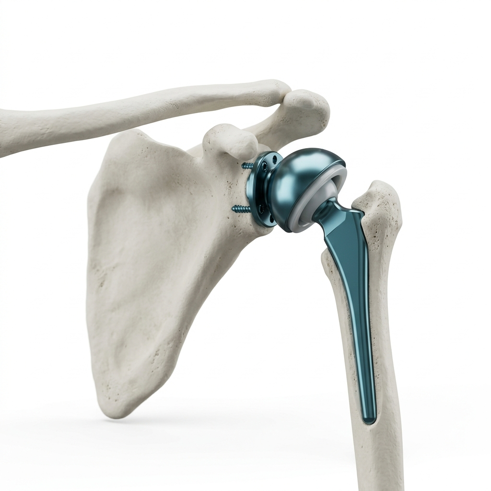
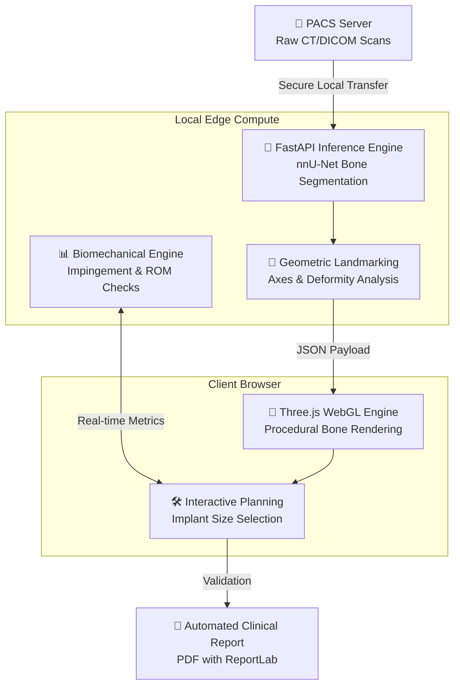
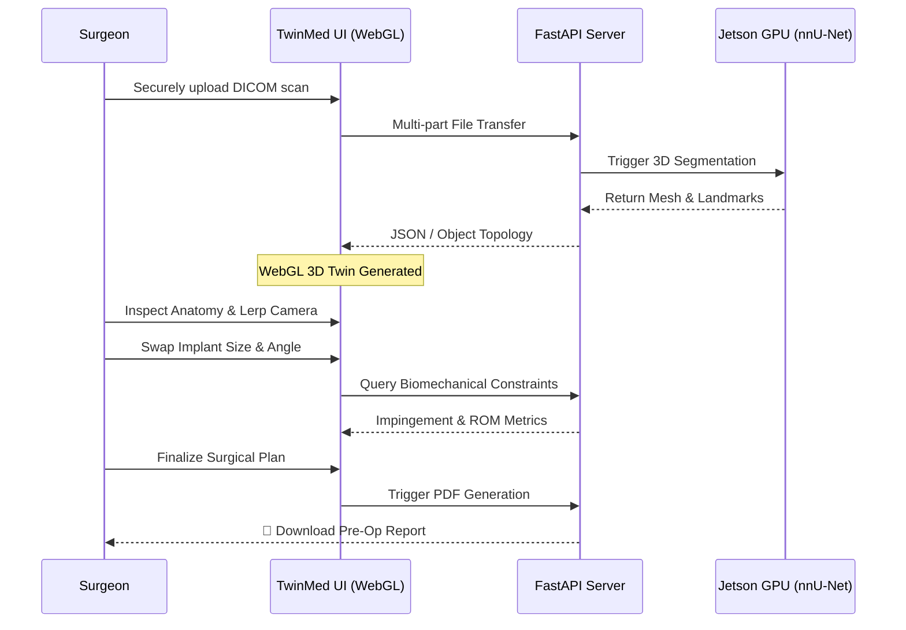

<div align="center">
  
# 🩻 TwinMed
**Edge-AI Powered Digital Twin Ecosystem for Orthopaedic Arthroplasty**

[](https://medha-medithon.web.app)
[](https://fastapi.tiangolo.com/)
[](https://threejs.org/)
[](https://developer.nvidia.com/embedded-computing)



*Democratizing advanced surgical planning for Tier-2 & Tier-3 hospitals through zero-latency Edge Compute and Vendor-Neutral 3D Analytics.*

</div>

---

## 🚀 The Vision

Modern 3D orthopaedic planning software is strictly locked behind massive paywalls, bound to proprietary cloud servers, and strictly limited to a single vendor's implant ecosystem. **TwinMed** shatters these limitations. 

Built natively for the **NVIDIA Jetson AGX Orin**, TwinMed operates directly at the hospital edge. We ingest DICOM scans natively, segment bone structures via our highly optimized AI backbone, and render an interactive, 60 FPS WebGL Digital Twin—all while patient data never touches the public internet.

---

## ⚙️ Architecture & Edge Pipeline

TwinMed is completely decentralized and hardware-agnostic, leveraging lightweight web technologies and optimized AI inference.



---

## ⚡ Key Features

*   **🦴 Universal AI Segmentation:** One shared U-Net backbone trained across both shoulder and knee CT geometries (drastically reducing inference memory).
*   **🎮 Gamified 3D Planning:** Ultra-fluid, browser-based WebGL interface. No heavy desktop installations required. View the exact patient anatomy.
*   **🛡️ Out-of-Distribution Safety:** Our custom AI uncertainty head prevents mis-planning by explicitly deferring to the surgeon on severely deformed bone scans.
*   **🔗 Open Implant Library:** Supports Indian implants (Meril, Sushrut) rather than restricting surgeons to expensive western vendors.
*   **📄 One-Click Audit Reports:** Automatically generate clinical-grade PDF reports based on the surgeon's interactive session to track post-op outcomes.

---

## 🏥 Clinical Workflow Experience



---

## 🛠 Tech Stack

*   **Frontend**: Vanilla HTML/JS, CSS3 (Glassmorphism), **Three.js** (WebGL 3D Rendering)
*   **Backend Inference**: **FastAPI** (Asynchronous Python), Uvicorn
*   **AI/Deep Learning**: PyTorch, MONAI, nnU-Net
*   **Target Deployment**: **NVIDIA Jetson AGX Orin**, Local x86 Docker Containers

---

## 💻 Local Installation & Development

Running TwinMed on your local edge node is simple.

```bash
# 1. Clone the repository
git clone https://github.com/vinayakec69/MEDHA-THON.git
cd MEDHA-THON

# 2. Install Python backend dependencies
pip install fastapi uvicorn python-multipart pydantic reportlab

# 3. Spin up the FastAPI Edge Server
python3 server.py
```

*The server will mount on `http://0.0.0.0:8080`. Navigate to `http://localhost:8080` in any modern browser (Firefox recommended for Linux WebGL compatibility) to access the interactive TwinMed Dashboard.*

---

<div align="center">
<i>Engineered by Emphasis Lab for MedhaThon 2026.</i>
<br>
<b>Building the future of equitable, localized healthcare technology.</b>
</div>
